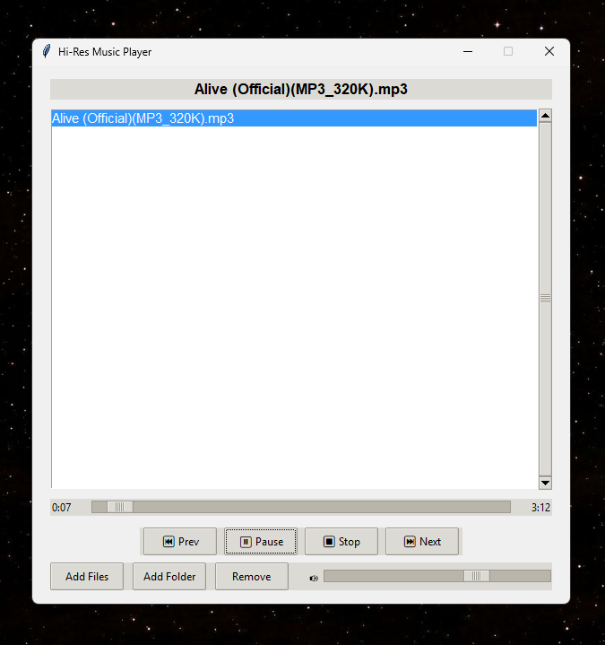

# 🎵 Hi-Res Music Player — Classic

A lightweight, cross-platform desktop music player written in pure Python. Built with **Tkinter** for the UI and **pygame** for audio playback, it plays your local music library with zero bloat — no Electron, no ads, no telemetry.

> Originally developed with assistance from an AI coding agent (Devin), as a demonstration of AI-assisted Python development.

---

## ✨ Features

- 📂 **Flexible library building** — add individual files or an entire folder at once
- 🎼 **Hi-res audio support** — MP3, WAV, OGG, and FLAC
- ▶️ **Full playback controls** — Play, Pause, Stop, Next, Previous
- 🔄 **Auto-advance** — automatically plays the next track when the current one ends
- 🎚️ **Seek bar** — drag to scrub anywhere in the track, with live elapsed / total time display
- 🔊 **Volume slider** — smooth, real-time volume control
- 👆 **Double-click to play** — click any playlist entry to jump straight to it
- 🔁 **Wrap-around navigation** — Next at the end of the list loops back to the first track
- 🛡️ **Graceful degradation** — track-length detection falls back automatically if `mutagen` is unavailable
- 🚫 **Duplicate protection** — the same file can't be added to the playlist twice

---

## 🧰 Tech Stack

| Component | Purpose |
|-----------|---------|
| [Python 3.8+](https://www.python.org/) | Core language |
| [Tkinter](https://docs.python.org/3/library/tkinter.html) | GUI (included with most Python installs) |
| [pygame](https://www.pygame.org/) | Audio playback (`pygame.mixer`) |
| [mutagen](https://mutagen.readthedocs.io/) | Audio metadata (track duration) |

---

## 📁 Project Structure

```
HI-Res-Music-Player-Classic/
├── AI Dev Music Player/
│   ├── music_player.py     # The entire application (single file)
│   └── requirements.txt    # Python dependencies
└── README.md
```

Yes — the whole app really is one file. ~350 lines. Classic.

---

## 🚀 Getting Started

### Prerequisites

- Python 3.8 or newer
- Tkinter (bundled with Python on Windows/macOS; on Linux install `python3-tk` via your package manager)

### Install dependencies

```bash
pip install -r "AI Dev Music Player/requirements.txt"
```

### Run the player

```bash
python "AI Dev Music Player/music_player.py"
```

> ⚠️ **Note:** the folder name contains spaces, so wrap the path in quotes (as shown above) on macOS/Linux.

The window titled **"Hi-Res Music Player"** will appear. Add your music and press Play.


<p align="center">
  
  <br/>
  <em>The player in action — clean, classic, zero bloat.</em>
</p>

---

## 📸 Screenshots

| Main Window |
|-------------|
|  |


---

## 🎮 Usage

1. **Add Files** — pick one or more audio files from a dialog.
2. **Add Folder** — loads every supported audio file in a folder (sorted alphabetically).
3. **Remove** — delete the selected entry from the playlist (removing the currently-playing track stops playback).
4. **▶ Play / ⏸ Pause / ⏹ Stop / ⏭ Next / ⏮ Prev** — standard transport controls.
5. **Drag the seek bar** to jump to any position in the track.
6. **Double-click any playlist entry** to play it directly.
7. Adjust **🔊 volume** with the slider.

### Supported formats

| Format | Extension |
|--------|-----------|
| MP3  | `.mp3`  |
| WAV  | `.wav`  |
| OGG  | `.ogg`  |
| FLAC | `.flac` |

---

## ⚙️ How It Works

- **Playback engine** — `pygame.mixer.music` handles decoding and output for all supported formats.
- **Track durations** — `mutagen.File()` reads real track lengths for the progress display. If mutagen isn't installed, the app probes the length via `pygame.mixer.Sound`, and finally falls back to the standard `wave` module for WAV files.
- **Seeking** — releasing the seek bar restarts playback from the chosen position (`pygame.mixer.music.play(start=...)`); the seek offset is tracked so the elapsed-time label stays accurate.
- **Auto-advance** — a 500 ms polling loop (`root.after`) checks whether the mixer is idle; when a track finishes it moves to the next one, or stops at the end of the playlist.
- **State tracking** — a small set of flags (`playing`, `paused`, `current_index`, `seek_offset`) keeps the UI button labels and playlist selection in sync with the audio state.

---

## 🗺️ Roadmap / Ideas

Contributions and ideas are welcome! Some natural next steps:

- [ ] Keyboard shortcuts (space = play/pause, arrows = prev/next)
- [ ] Shuffle and repeat modes
- [ ] Playlist persistence (save / load `.m3u` files)
- [ ] Drag-and-drop files onto the window
- [ ] System tray integration
- [ ] Album art display
- [ ] Resizable window and dark theme

---

## 🤝 Contributing

1. Fork the repository
2. Create a feature branch (`git checkout -b feature/amazing-idea`)
3. Commit your changes (`git commit -m "Add amazing idea"`)
4. Push to the branch (`git push origin feature/amazing-idea`)
5. Open a Pull Request

---

## 📜 License

This project currently has no license specified. If you'd like others to use or contribute to it, consider adding an [MIT License](https://choosealicense.com/licenses/mit/).

---

<div align="center">
  Made with 🐍 Python, Tkinter & pygame · Classic vibes only
</div>
